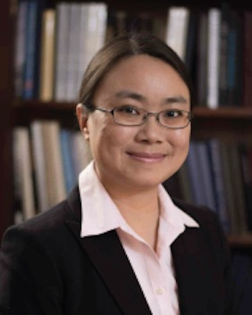
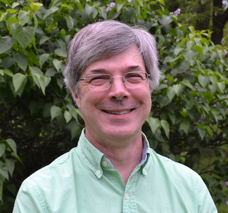
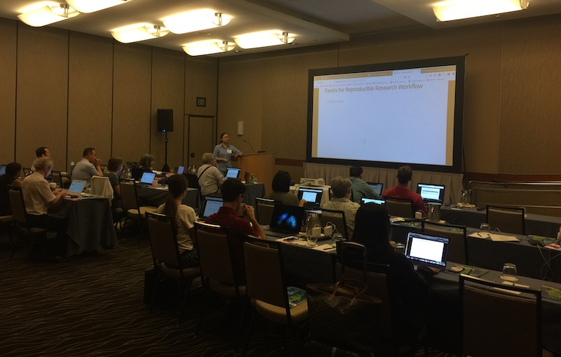
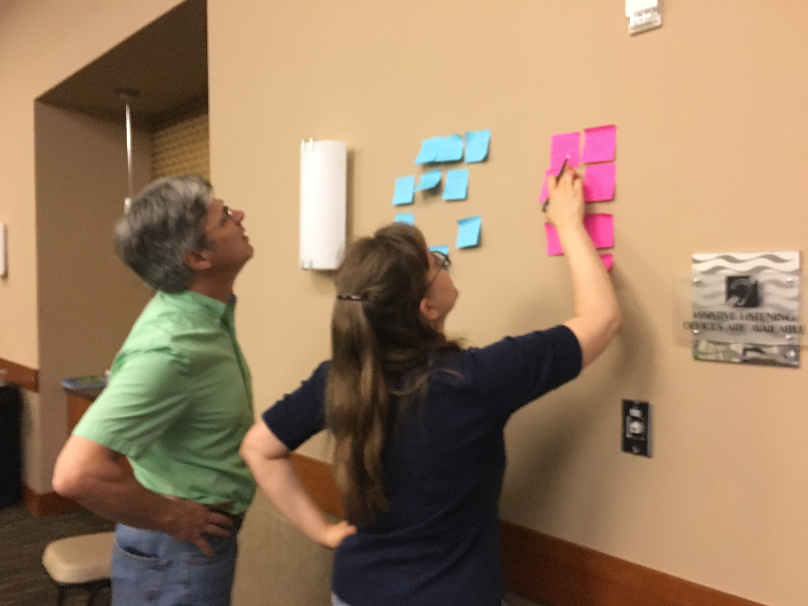

# Co-Authors

.pull-left[

Dr. Ye Li, Librarian for Chemistry & Chemical Engineering,  MIT]

.pull-right[

Dr. Steven Wathen, Professor of Chemistry, Siena Heights University]

---

# Summary

At the Fall 2019 American Chemical Society National Meeting, two chemistry librarians partnered with a chemistry faculty member to offer a hands-on computer programming workshop. The workshop used the R programming environment and was structured for beginners with no previous experience with it. Three main topics were covered during the five-hour session: introduction to R, working with QSAR data, and creating a report using R Markdown. This report will cover the workshop’s logistics, instructional design and content, and discuss feedback received from participants. Suggestions for future improvements will also be discussed.

---

# Event Goals and Target Audience

--

Provide intro to the R programming environment for chemists

--

Script-based data analysis and authoring tools allow chemists to streamline data workflows and enhance reproducibility

--

Improve transparency and reproducibility of research processes

--

Hands-on learning experience for participants

--

Resources for participants to share with their communities

--

Intended audience: attendees at the Fall 2019 ACS National Meeting: chemical information professionals, students, and librarians

---

# Logistics

--

Date and Time: Saturday, August 24, 2019, 9am-2pm, two short breaks and a longer break for lunch

--

Location of Workshop: Omni Hotel, an ACS Conference Hotel and in close proximity to the convention center

--

Number of Attendees: 18

--

Cost of Workshop: 
- Instructors donated their time
- Each participant paid a $40 registration fee
- ACS Publications generously sponsored the rest of the facilities fees
- ACS Division of Chemical Information provided logistical support and contingency funding

---

# Instructional Design

Approach using a Carpentries-style model: sticky notes for feedback, non-lecturing instructors providing individual support

.pull-left[]
.pull-right[]
---

# Content

The workshop was broken down into three parts:

--

1. Introduction to R and the RStudio Environment (taught by Ye)

--

2. Working with QSAR data (taught by Steve)

--

3. Creating a reproducible report using R Markdown (taught by Donna)

--

Participants used a RStudio Cloud interface.

---

# Want to have a look?

--

Materials repo: 
https://github.com/YeLibrarian/R_ACS_20190824Materials

---

# Thanks!

--

**ACS Publications** is gratefully acknowledged for their generous financial sponsorship of this event, without which it would not have been able to go forward.

--

The **ACS Division of Chemical Information** is also deeply thanked for their commitment and support, including logistical assistance and contingency funding.

--

**YOU** for your attention and interest!

--

I finally leared to create slides with [**xaringan**](https://github.com/yihui/xaringan). Thanks Yihui :)